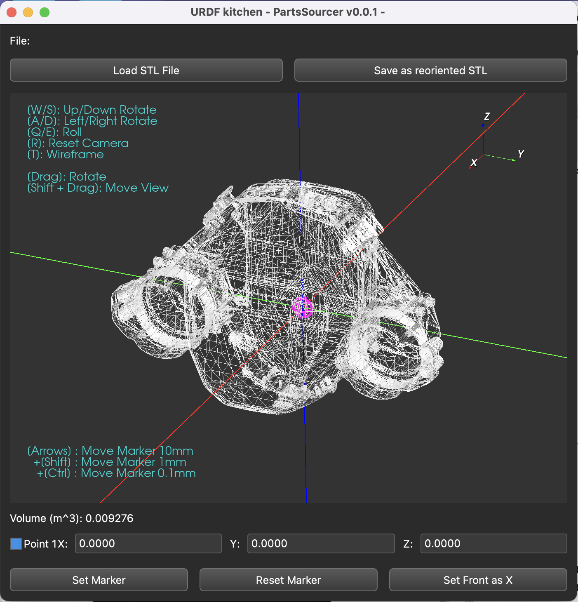
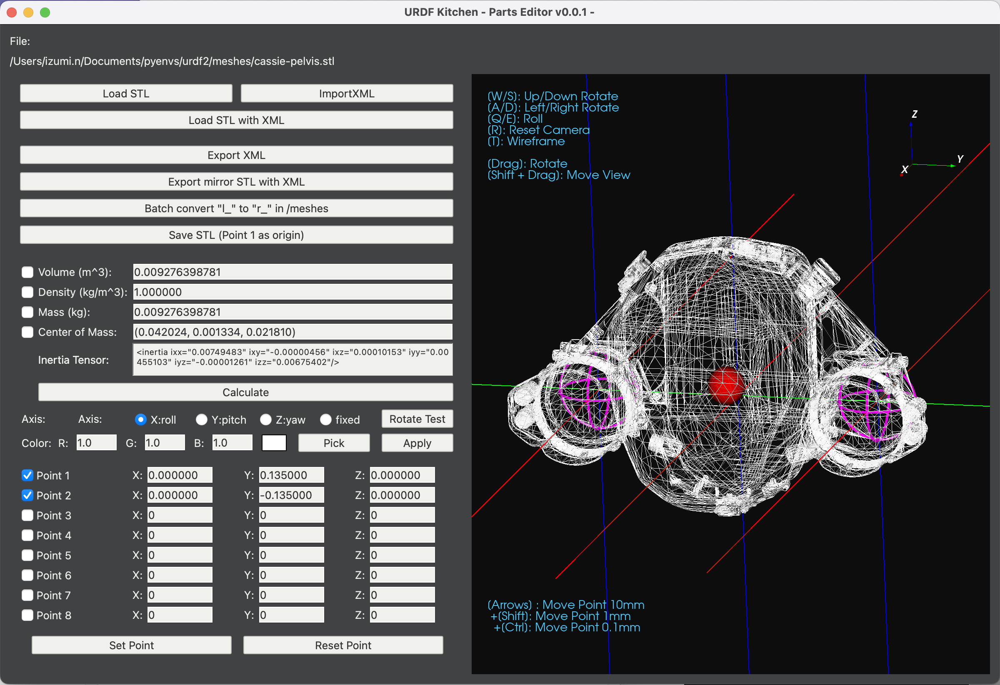
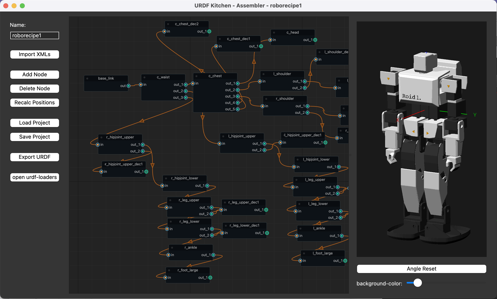
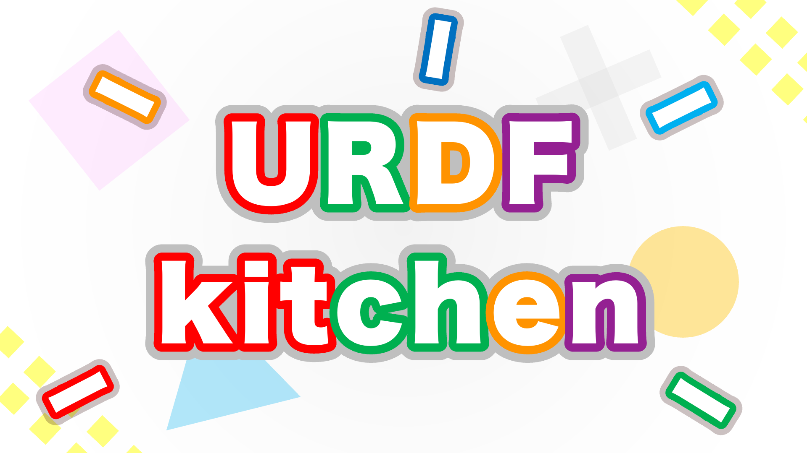

# URDF_kitchen beta  
  
  
URDF_kitchenは、URDFの組み立てをサポートするPythonツールです。  
STLファイルにジョイントポイントを設定し、ノードで接続していくことで組み立て、URDFとしてエクスポートします。  
重量入力やイナーシャ計算、パーツごとの着色などにも対応しています。  
  
# Tools  
  
### STEP 1 -  仕込み -  "StlSourcer"  
  
Stlの中心点や座標軸の入れ替えを行うツールです。  
この工程は不要な場合がほとんどです。  
  
### STEP 2 - 調理 - "PartsEditor"  
  
stlファイルに次のパーツを接続するジョイントポイントを設定するツールです。  
ジョイントポイントは8つまで設定でき、回転軸や色なども設定できます。  
左右対称のロボットの場合、左側のパーツさえ設定すれば右側は自動で出力できます。  
設定ファイルはパーツと対になるxmlとして保存します。  
  
### STEP 3 - 盛り付け - "Assembler"  
  
urdfをプラモデルのように最後の組み立てられるツールです。  
設定ファイルをまとめて読み込み、パーツ同士をノードでポチポチと接続していきます。  
作業途中のファイルを保存する機能や、回転軸を確認する機能などもあります。  
  
完成したURDFのチェックは、Garrett Johnsonが作成したブラウザツールで可能です。
ツール内にもリンクのボタンを設置しています。

https://gkjohnson.github.io/urdf-loaders/javascript/example/bundle/

# Install  
python 3.9などで動作します。(3.10はライブラリの都合で素直に動かないかもしれません)  
  
### libraryとpip  
  
```
pip install numpy  
pip install PySide6  
pip install vtk  
pip install NodeGraphQt  
```

### 実行方法  
  
ターミナルにて、DLしたファイルがある場所にcdで移動し、  
python urdf_kitchen_StlSourcer.py  
python urdf_kitchen_PartsEditor.py  
python urdf_kitchen_Assembler.py  
と入力して実行します。初回起動は少し時間がかかります。  
  
# バグレポート  
  
絶賛バグフィックス中です。  
特にパラメータの計算や反映について検算や検証が必要です。  

- urdf_kitchen_StlSourcer.py で回転を繰り返すと誤差が蓄積するようです。回転前に一度Rでリセットし、最小の回転回数で保存を行うとズレを抑えられる可能性があります。(20241214)  
- AssemblerでRotationをFixedにしたとき、Rotation Testボタンで本来は動かないべきだが、Z軸で回転する(20241214)  
  
# Tutorial  

作業のフローをとりいそぎ下記の記事にまとめました。  
公式のチュートリアルやガイドも別途製作中です。  

https://qiita.com/Ninagawa123/items/c4643ca92e57c3a45efb  
 
[]([https://github.com/deepmind/mujoco](https://qiita.com/Ninagawa123/items/c4643ca92e57c3a45efb)

