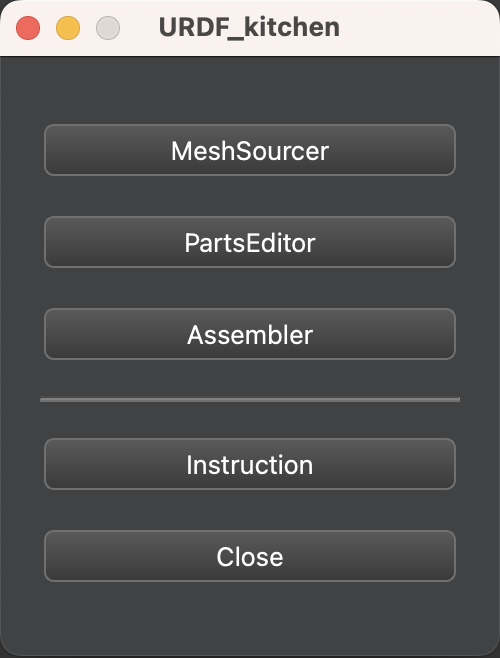
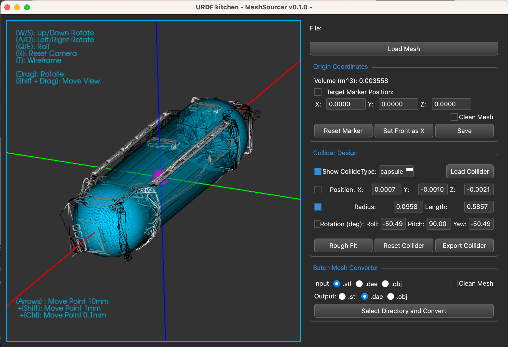
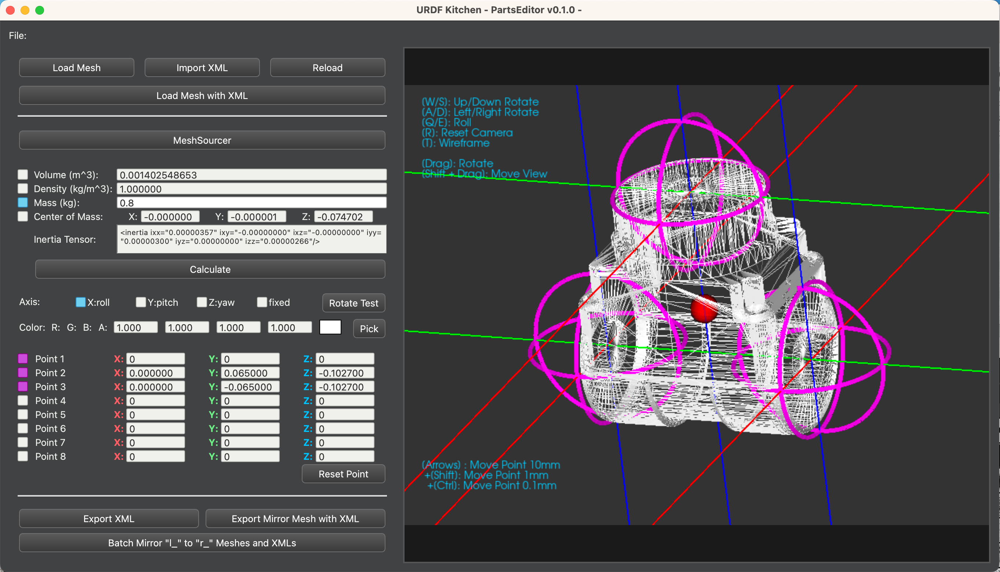
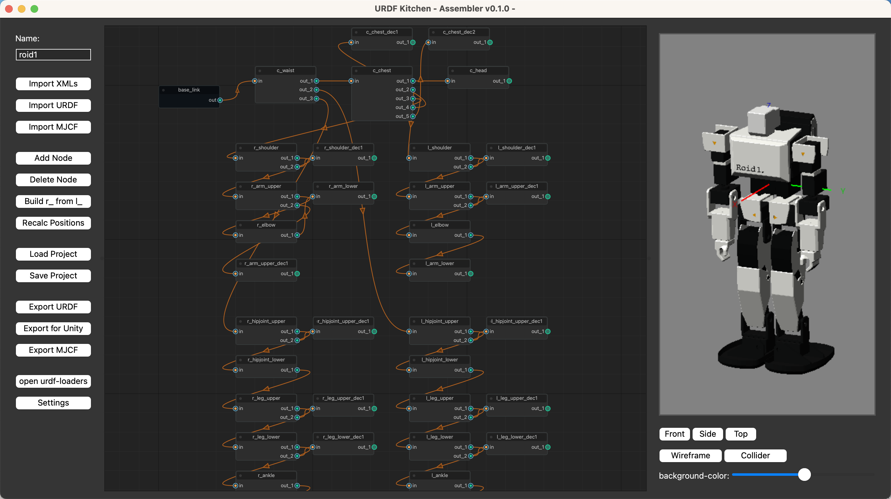

# URDF_kitchen beta2!  
  
  
URDF_kitchenは、ロボットモデルの記述方式であるURDFやMJCFの作成をサポートするPythonツール群です。  
Meshファイルにジョイントポイントを設定し、ノードで接続していく方式となっており、GUIで直感的にロボットファイルを組み立てることができます。  
普段使っているCADがURDFやMJCFの出力に対応していない場合や、手書きでXMLファイルを作成している場合に役立ちます。  
重量入力や重心設定、イナーシャ計算、パーツごとの着色などにも対応しています。  
  
Beta2版ではMeshファイルとして.stlに加え新たに.obj,.daeファイルに対応しました。  
Colliderの設定にも対応し、ColliderとしてMeshを設定できる他、立方体や円錐なども設定できるようになりました。  
おまけ機能としてURDF,MJCFを読み込むことも可能となり、既存のファイルをGUI上で調整することができます。  
（URDF,MJCFの読み込み機能はまだ簡易的で、とくにMJCFの再現はまだ弱いです。）  
  
コードがPythonであるため、AIコーディングを活用すればユーザーが自由にUI変更やデバグ、機能拡張などをすることができます。  
  
# Tools  
  
### STEP 0 -  仕込み -  "Launcher"  
  
MeshSourcer, PartsEditor, Assemblerの3つのツールを起動できるラウンチャーです。  
作業はフローはMeshSourcerでパーツの下拵えをし、PartsEditorで接続部分を設定、Assemblerで組み立てて仕上げるという流れになります。  
  
### STEP 1 -  仕込み -  "MeshSourcer"  
  
組み立ての準備の工程として、まずお手持ちのCADでロボットの部品を動くまとまりごとにユニット化し、可動の起点を原点として出力しておきます。  
MeshSourcerはそれをサポートするツールで、下記の処理が可能です。  

- .stl, .dae, .objの読み込み  
- .stl, .dae, .objへの書き出し, 複数ファイル一括変換  
- Meshの中心点や座標軸の入れ替え  
- Meshに該当する簡易Colliderの作成(Box, Cylinder, Sphere, Capsule)  
  
### STEP 2 - 調理 - "PartsEditor"  
  
ユニットのMeshファイルを見ながら次のパーツを接続するジョイントポイントを設定するツールです。  
ジョイントポイントは8つまで設定でき、回転軸や色なども設定や確認ができます。  
左右対称のロボットの場合、左側のパーツさえ設定すれば右側は自動で出力できます。  
設定ファイルはパーツと対になるxmlとして保存できます。  
  
### STEP 3 - 盛り付け - "Assembler"  
  
urdfをプラモデルのように組み立てられるツールです。  
設定ファイルをまとめて読み込み、パーツ同士をノードでポチポチと接続していきます。  
また、Jointの各種パラメータも設定することができます。  
こちらも、左側だけ設定や組み立てを行えば、右側は自動で組み立てることができます。  
作業途中のファイルを保存する機能や、回転軸を確認する機能などもあります。  
  
URDFとMJCFをエクスポートすることができます。  
完成したURDFのチェックは、Garrett Johnsonが作成したブラウザツールで可能です。  
ツール内にもリンクのボタンを設置しています。  
    
https://gkjohnson.github.io/urdf-loaders/javascript/example/bundle/  
  
# Install  
python 3.11 と M4 Macの組み合わせで動作確認をしています。  
  
### libraryとpip  
  
```
pip install numpy  
pip install PySide6  
pip install vtk  
pip install NodeGraphQt
pip install trimesh
pip install pycollada
pip install networkx
```  
  
##### 起動できない場合  
前回のバージョンで、Windows11+python3.12で起動できないという報告がありました。  
python3.12から消えたdistutilsが原因とのことで、  
NodeGraphQtのmenu.py,viewer.pyについて、  
from distutils.version import LooseVersion  
から  
from packaging.version import Version as LooseVersion  
に修正することで起動したとのことです。  
  
### 実行方法  
  
ターミナルにて、DLしたファイルがある場所にcdで移動し、  
python urdf_kitchen_Launcher.py  
でラウンチャーを起動した後、各アプリを起動します。  
urdf_kitchen_StlSourcer.py  
urdf_kitchen_PartsEditor.py  
urdf_kitchen_Assembler.py  
はpythonで直接実行することもできます。  
urdf_kitchen_utils.py  は他のコードと同じディレクトリにおいてください。  
  
# バグレポート  
  
絶賛バグフィックス中です。  
  
# Tutorial  

前回のバージョンのものですが、作業のフローは下記の記事にまとまっています。  
公式のチュートリアルやガイドも別途製作中です。  
  
https://qiita.com/Ninagawa123/items/c4643ca92e57c3a45efb  
  
<a href="https://qiita.com/Ninagawa123/items/c4643ca92e57c3a45efb">
    
</a>
