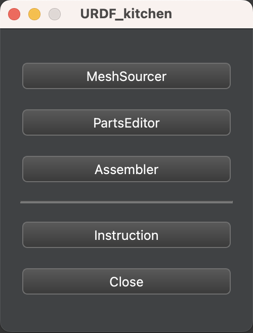
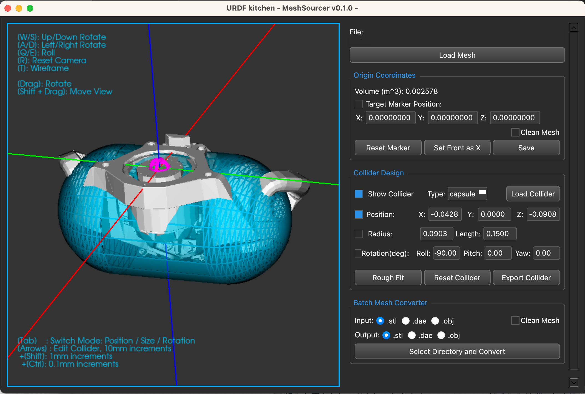
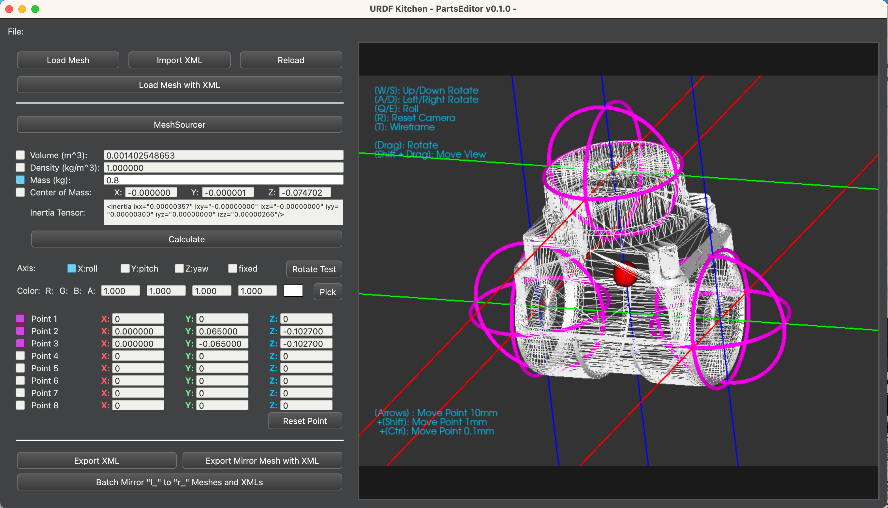
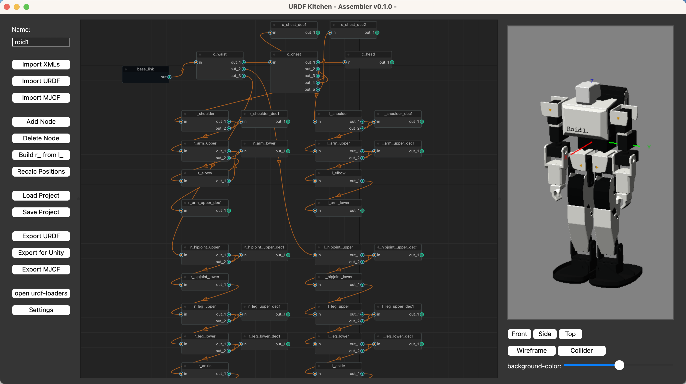
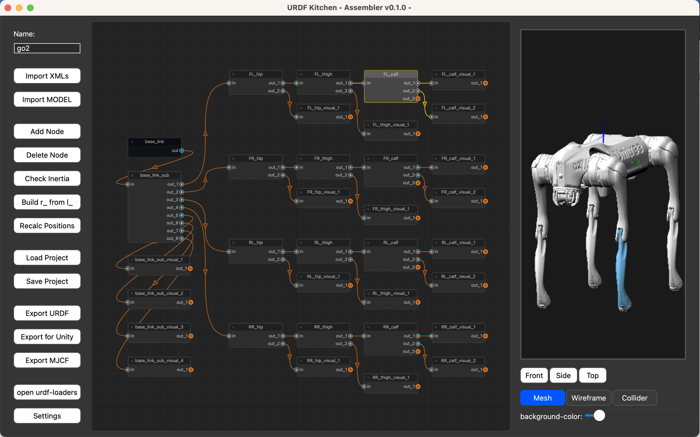

# URDF_kitchen beta2
[English](README.md) | [日本語](README_JP.md)


URDF_kitchen is a Python-based GUI toolset that supports creating robot models described in URDF and MJCF formats.  
It allows users to define joint connection points on mesh files and assemble robot models by connecting nodes in a GUI.  
This tool is useful when your CAD software does not support exporting URDF or MJCF, or when you have been manually editing XML files.  
It also supports mass input, center-of-mass settings, inertia calculation, and per-part coloring.

In the beta2 release, URDF_kitchen supports `.obj` and `.dae` mesh files in addition to `.stl`.  
Collider configuration is also supported: meshes can be used as colliders, or simple primitive shapes such as boxes, cylinders, spheres, and capsules can be assigned.  
As a bonus feature, existing URDF and MJCF files can be imported and adjusted within the GUI.

Since the codebase is written in Python, users can freely modify the UI, fix bugs, or extend functionality using AI-assisted coding.

[](https://youtu.be/bFbzFkxpJYs?si=5_F-aAvivPTxLGRe)

---

## Quick Start

Please either download and extract the repository from the green button at the top right of the [/beta2 branch](https://github.com/Ninagawa123/URDF_kitchen/tree/beta2), or clone the repository with git clone and switch to the beta2 branch before getting started.

Create a Python 3.11 virtual environment and run:

```bash
pip install numpy PySide6 vtk NodeGraphQt trimesh pycollada networkx xacrodoc
```

Move to the directory containing `urdf_kitchen_Launcher.py` and run:

```bash
python urdf_kitchen_Launcher.py
```
  
>If you use `uv`, you can reproduce the environment with:
>
>```bash
>uv sync
>```
>
>Move to the directory containing `urdf_kitchen_Launcher.py` and run:
>
>```bash
>uv run urdf_kitchen_Launcher.py
>```
  
Click the **Assembler** button to launch it (the first startup may take some time).

In Assembler, click **Import XMLs** and select `sample/Roid1_assets`.  
Robot parts will be expanded as nodes.  
Drag the `out` port of `base_link` and connect it to the `in` port of any node.  
By chaining `out` and `in` ports, you can assemble the robot model.
  
---

## Tools

### STEP 0 – Introduction – "Launcher"


The Launcher allows you to start the three tools: MeshSourcer, PartsEditor, and Assembler.  
The workflow is:
1. Prepare parts in MeshSourcer  
2. Define connections in PartsEditor  
3. Assemble the robot in Assembler

---

### STEP 1 – Preparation – "MeshSourcer"


Before assembly, robot parts should be exported from your CAD software as individual units, each with its rotation origin set correctly.  
MeshSourcer supports this preparation step with the following features:

- Import `.stl`, `.dae`, `.obj` files  
- Export `.stl`, `.dae`, `.obj` files and batch conversion  
- Adjust mesh origin and coordinate axes  
- Create simple colliders for meshes (Box, Cylinder, Sphere, Capsule)

---

### STEP 2 – Cooking – "PartsEditor"


PartsEditor lets you define joint connection points while viewing each unit’s mesh.  
Up to eight joint points can be defined, and rotation axes and colors can be set and previewed.  
For left-right symmetric robots, defining only the left-side parts is sufficient—the right side is generated automatically.  
Settings are saved as XML files paired with each part.

---

### STEP 3 – Plating – "Assembler"


Assembler allows you to build URDF models like assembling a plastic model kit.  
You can load all configuration files at once and connect parts by clicking nodes.  
Joint parameters can also be adjusted here.

If you assemble only the left side, the right side can be generated automatically.  
You can save work-in-progress files and preview rotation axes.  
A simplified inertia check is provided, allowing quick fixes when imported inertia tensors are invalid.

Completed models can be exported as URDF or MJCF files.  
URDF models can be checked using the browser-based tool created by Garrett Johnson (linked in the UI):

https://gkjohnson.github.io/urdf-loaders/javascript/example/bundle/

MJCF models can be verified by dropping the exported `scene.xml` file into the MuJoCo application.

---

### OMAKE – Bonus Feature – "Import MODEL"


The **Import MODEL** button in the top-left of Assembler allows you to import existing URDF, SDF, or MJCF files and expand them into node form.  
Most models published on GitHub can be loaded.  
You can even visually combine different robots.

Note: Closed-loop structures and some parameters are not fully supported.  
Please adjust them manually or with AI-assisted coding if needed.

---

## Install

The following environments have been tested:
- Python 3.11 on macOS (M4 Mac)
- Python 3.13 on Windows 11  
  
### Libraries and pip  
  
We recommend creating a Python 3.11 virtual environment.  
Install dependencies with:  
  
```bash  
pip install numpy PySide6 vtk NodeGraphQt trimesh pycollada networkx xacrodoc  
```  
  
### Running  
  
From a terminal or PowerShell, move to the directory containing the downloaded files and run:  
  
```  
python urdf_kitchen_Launcher.py  
```  
  
to start the launcher and launch each application.  
(If the launcher cannot be found, please switch the repository branch from main to beta2.)  
  
Each application can also be launched directly with Python:  
  
```  
python urdf_kitchen_MeshSourcer.py  
python urdf_kitchen_PartsEditor.py  
python urdf_kitchen_Assembler.py  
```  
  
urdf_kitchen_utils.py and urdf_kitchen_Importer.py are module files required for running the applications, so please place them in the same directory as the other code files.
  
---

## Bug Reports

We are actively fixing bugs.  
Please report issues as you find them.

---

## Tutorial

The tutorial is available here:  
https://github.com/Ninagawa123/URDF_kitchen/blob/beta2/Tutorial_EN.md

Although written for a previous version, the workflow is summarized in the following article, too.  

https://qiita.com/Ninagawa123/items/c4643ca92e57c3a45efb


